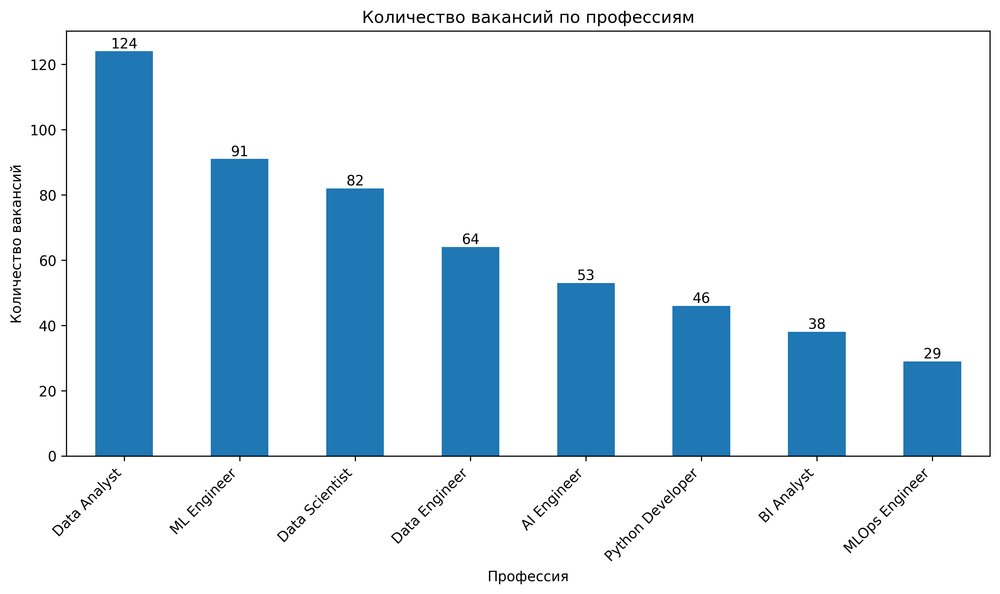
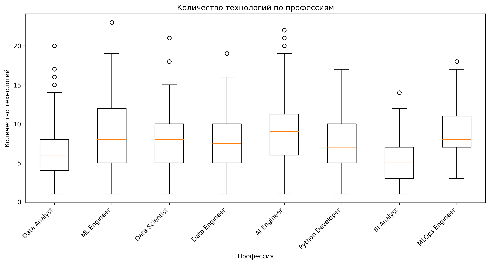
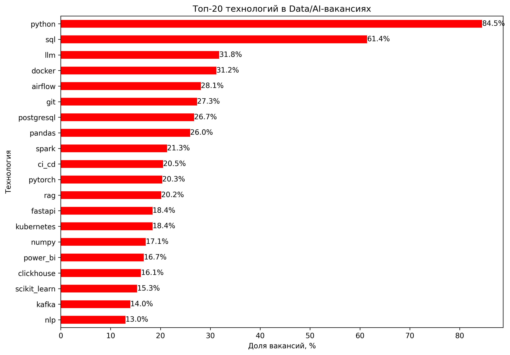
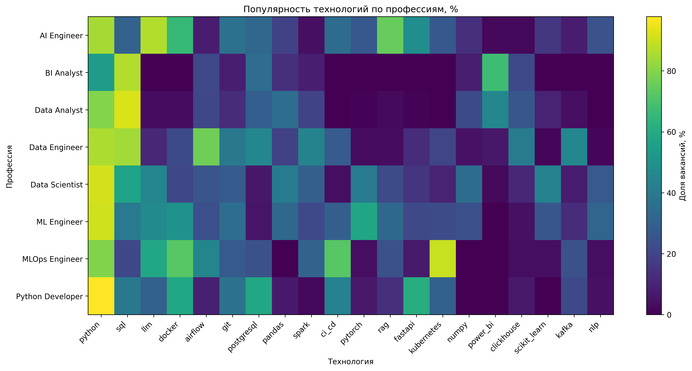
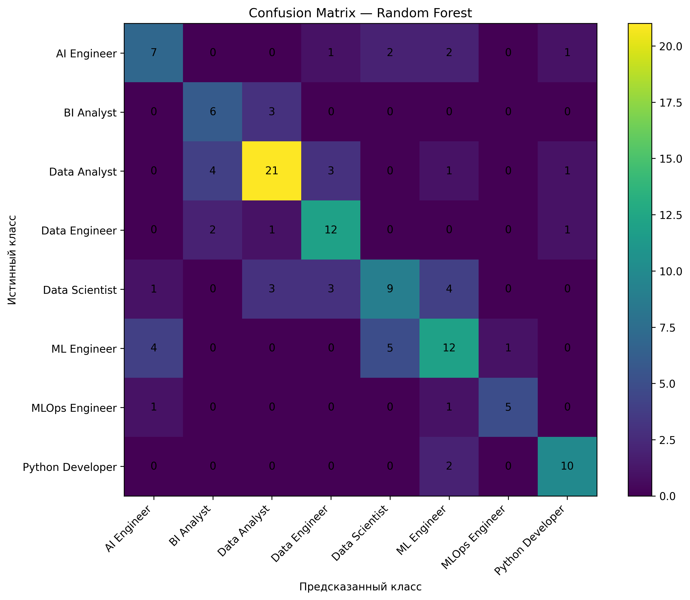

# Data Career Map

Анализ рынка вакансий в направлениях Data Science, Machine Learning,
Data Engineering, BI, MLOps, AI и Python Development.

Проект включает сбор вакансий с помощью web scraping, очистку данных,
извлечение технологического стека, статистический анализ и построение
моделей машинного обучения для классификации профессиональной роли
по требуемым технологиям.

## Цель исследования

Цель проекта — исследовать различия между современными Data/AI-профессиями
по требуемому технологическому стеку и опыту работы, а также проверить,
можно ли определить профессиональную роль вакансии на основе указанных
в ней технологий.

Основные исследуемые направления:

- Data Analyst
- BI Analyst
- Data Scientist
- ML Engineer
- Data Engineer
- MLOps Engineer
- AI Engineer
- Python Developer

## Исследовательские вопросы

1. Какие технологии наиболее часто встречаются в Data/AI-вакансиях?
2. Чем технологические стеки разных профессий отличаются друг от друга?
3. Различается ли количество требуемых технологий между профессиями?
4. Связана ли профессиональная роль с требуемым опытом?
5. Связано ли количество технологий с уровнем требуемого опыта?
6. Можно ли классифицировать профессиональную роль по набору технологий?

## Данные

В рамках проекта было собрано 1257 уникальных вакансий.

Для 1250 вакансий удалось получить полное описание.

После очистки названий профессий и удаления нерелевантных вакансий
в основном наборе данных осталось 527 вакансий.

Для анализа технологического стека использовались 516 вакансий,
для которых было доступно описание и найден хотя бы один технологический
навык.

## Сбор данных

Для сбора данных использовались:

- `requests`
- `BeautifulSoup`
- `pandas`

Из поисковой выдачи извлекались:

- название вакансии;
- компания;
- город;
- требуемый опыт;
- URL;
- поисковый запрос.

После этого выполнялся отдельный запрос к странице каждой вакансии
для получения полного описания.


## Извлечение технологического стека

Из описаний вакансий извлекались упоминания технологий и инструментов.

Среди анализируемых технологий:

- Python
- SQL
- PostgreSQL
- pandas
- NumPy
- scikit-learn
- PyTorch
- TensorFlow
- Power BI
- Tableau
- Docker
- Kubernetes
- Airflow
- Spark
- Kafka
- MLflow
- LLM
- RAG
- LangChain
- FastAPI
- Git
- CI/CD

и другие.

Для каждой технологии создавался бинарный признак:

- `1` — технология упоминается в вакансии;
- `0` — технология не обнаружена.


## Исследовательский анализ

После очистки распределение вакансий выглядело следующим образом:

| Профессия | Количество | Доля |
|---|---:|---:|
| Data Analyst | 124 | 23.5% |
| ML Engineer | 91 | 17.3% |
| Data Scientist | 82 | 15.6% |
| Data Engineer | 64 | 12.1% |
| AI Engineer | 53 | 10.1% |
| Python Developer | 46 | 8.7% |
| BI Analyst | 38 | 7.2% |
| MLOps Engineer | 29 | 5.5% |


### Требуемый опыт

В выборке:

- 52.0% вакансий требуют 3–6 лет опыта;
- 34.2% — 1–3 года;
- 9.3% — более 6 лет;
- 4.6% — без опыта.


### Наиболее часто встречающиеся технологии

Среди вакансий с определённым технологическим стеком наиболее часто
встречались:

| Технология | Доля вакансий |
|---|---:|
| Python | 84.5% |
| SQL | 61.4% |
| LLM | 31.8% |
| Docker | 31.2% |
| Airflow | 28.1% |
| Git | 27.3% |
| PostgreSQL | 26.7% |
| pandas | 26.0% |
| Spark | 21.3% |
| CI/CD | 20.5% |


### Распределение профессий





### Наиболее популярные технологии



### Технологические профили профессий




## Статистический анализ

### Нормальность распределения

Распределение количества найденных технологий не соответствовало
нормальному распределению:

- Shapiro-Wilk: `p < 0.001`
- skewness: `0.756`
- kurtosis: `0.38`

Поэтому для сравнения нескольких профессиональных групп использовались
непараметрические методы.

### Различия количества технологий между профессиями

Критерий Краскела–Уоллиса:

- `H = 43.014`
- `p < 0.001`

Нулевая гипотеза была отвергнута.

Количество обнаруженных технологий статистически значимо различается
между профессиональными группами.

Наибольшее среднее количество технологий наблюдалось у:

- AI Engineer — 9.31;
- MLOps Engineer — 9.03;
- ML Engineer — 8.78.

Для BI Analyst среднее составляло 5.30, а для Data Analyst — 6.39.


### Связь профессии и требуемого опыта

Для проверки связи использовался критерий x^2 Пирсона.

Результат:

- `x^2 = 30.373`
- `p = 0.085`

При уровне значимости 0.05 статистически значимая связь между
профессиональной ролью и категорией требуемого опыта подтверждена не была.

Часть ожидаемых частот была меньше 5, поэтому результат следует
интерпретировать с осторожностью.


### Опыт и количество технологий

Корреляция Спирмена между уровнем опыта и количеством технологий:

- `ρ = 0.085`
- `p = 0.053`

Обнаружена очень слабая положительная связь, однако она не достигла
статистической значимости при α = 0.05.

## Машинное обучение

Была поставлена задача многоклассовой классификации:

**X** — бинарные признаки технологий.

**y** — профессиональная роль вакансии.

В качестве моделей использовались:

- Dummy Classifier;
- Logistic Regression;
- Random Forest;
- Random Forest после настройки GridSearchCV.


### Сравнение моделей

| Модель | CV Macro F1 | Test Macro F1 |
|---|---:|---:|
| Dummy Classifier | 0.047 | 0.047 |
| Logistic Regression | 0.505 | 0.616 |
| Random Forest | 0.539 | 0.642 |
| Tuned Random Forest | **0.550** | 0.628 |

По результатам 5-fold cross-validation лучший средний результат показал
Random Forest после настройки гиперпараметров:

`Macro F1 = 0.550`.


Лучшие параметры Random Forest:

```python
{
    "max_depth": 10,
    "max_features": "sqrt",
    "min_samples_leaf": 1,
    "min_samples_split": 5,
    "n_estimators": 400
}

```
---


## Используемые технологии

- Python
- pandas
- NumPy
- requests
- BeautifulSoup
- matplotlib
- SciPy
- statsmodels
- scikit-learn
- joblib
- Jupyter Notebook
- Git
- GitHub

## Ограничения

Исследование имеет ряд ограничений:

1. Используется выборка вакансий из одного источника.
2. Поисковая выдача может содержать вакансии, не полностью соответствующие
   поисковому запросу.
3. Классификация профессиональных ролей выполнялась на основе названия
   вакансии и набора правил.
4. Технологии определялись с помощью словаря и регулярных выражений,
   поэтому некоторые технологии могли быть пропущены.
5. Набор данных относительно небольшой для восьмиклассовой задачи.
6. Некоторые профессии имеют существенно меньше наблюдений, чем другие.
7. Технологические стеки Data Scientist, ML Engineer и AI Engineer
   значительно пересекаются.

### Наиболее информативные признаки

Для Random Forest наиболее важными признаками для разделения
профессиональных ролей оказались:

- Kubernetes
- Airflow
- SQL
- Power BI
- Docker
- CI/CD
- FastAPI
- LLM
- PyTorch
- PostgreSQL

Важно: feature importance показывает не популярность технологии
на рынке, а её полезность для разделения профессиональных классов.


### Ошибки классификации



Наиболее частые ошибки наблюдались между близкими по технологическому
стеку направлениями, прежде всего Data Scientist, ML Engineer
и AI Engineer.


### Вывод по машинному обучению

В рамках проекта была решена задача многоклассовой классификации профессиональной роли вакансии по набору указанных технологий.

Для сравнения использовались Dummy Classifier, Logistic Regression и Random Forest. Дополнительно для Random Forest была выполнена настройка гиперпараметров с помощью GridSearchCV.

Лучший средний результат по 5-fold cross-validation показал настроенный Random Forest:

- `CV Macro F1 = 0.550`
- `Test Macro F1 = 0.628`

Обычный Random Forest показал несколько более высокий результат на конкретной тестовой выборке (`Macro F1 = 0.642`), однако настроенная модель продемонстрировала более высокий средний результат при кросс-валидации.

Dummy Classifier показал существенно более низкое качество (`Macro F1 = 0.047`), поэтому можно сделать вывод, что технологический стек действительно содержит информацию о профессиональной роли вакансии.

Наиболее сложным для классификации оказался класс Data Scientist. Основные ошибки возникали между технологически близкими направлениями Data Scientist, ML Engineer и AI Engineer, что связано со значительным пересечением их технологических стеков.
